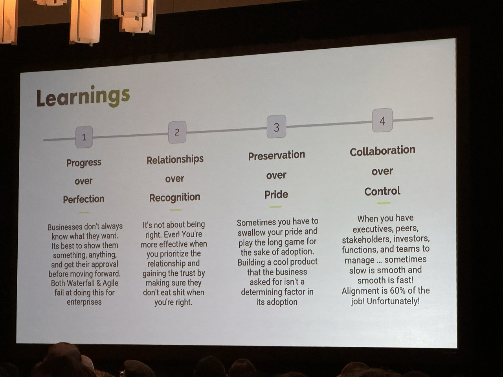
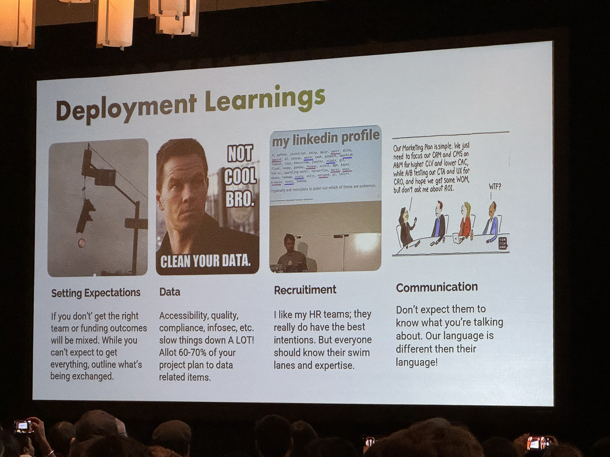
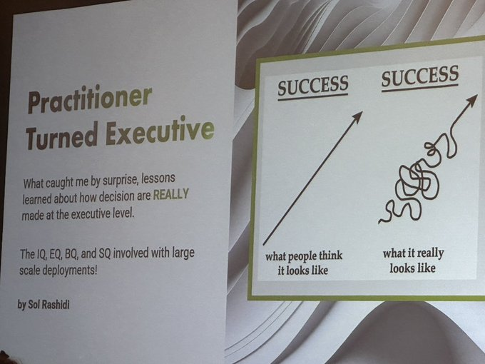
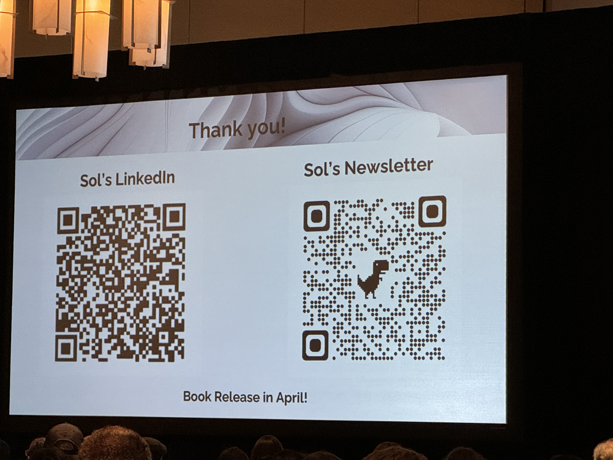
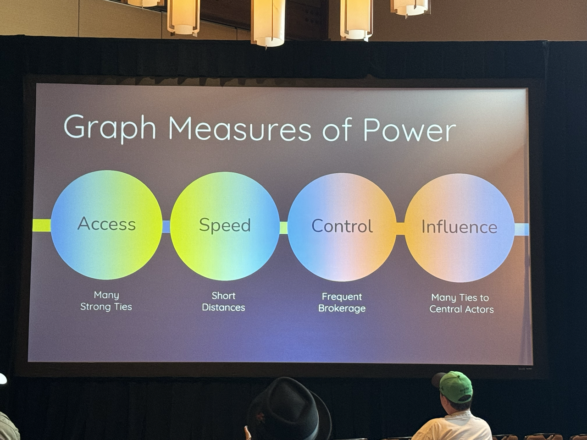
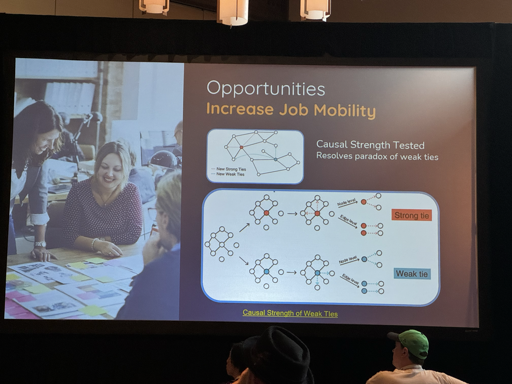

# Data Day Texas 2024

This repo contains:

- A Poetry environment for running notebooks from the two workshops I attended at [Data
  Day Texas][ddtx] 2024 along with a few minor tweaks to get things working
- The few photos I took from a couple of talks. Ideally, {[worthyl][worthyl],
  [gstrat43][gstrat43]} will PR their notes/photos in as well.
- The original summary for each session from the [ddtx site][ddtx].

Where repos are linked, just clone 'em in this directory for links into each to work.

I used to [post][ddtx17] [ddtx][ddtx19] [notes][ddtx20] [as][ddtx22] [gists][ddtx23],
but since there are notebooks from the workshops this time around, I figured why not
share what I did to get them running. (It's not a lot, but still...)

## Plenary Keynote: Practitioner turned Executive

**What caught me by surprise & lessons I learned about how decisions are really made**
**with data ecosystems.**

Speaker: [Sol Rashidi][rashidi]

Sol will present an unfiltered and transparent conversation about the unexpected
challenges and revelations she experienced pivoting from a hands-on data practitioner to
a strategic data executive. She'll discuss the successes, failures, and the exchange of
popularity one has to sometimes make, in order to make progress when deploying
large-scale data ecosystems. There are under-appreciated intricacies involved in
transitioning from a technical role to an executive position, and there is EQ, SQ, and
BQ that must to be developed to compliment the IQ. While it may be obvious what needs to
be done, Sol will share the real-world processes and politics that drive the
decision-making in the data world.

  


([Worthy][worthy]): Sol came across as the "rockstar" of the conference.  She definitely
made an impression as there were many "selfies" with her posted on social media.  

## Introduction to Graph Data Science for Python Developers

Speaker: [Sean Robinson][robinson] - [Graphable][graphable]

This workshop will cover a variety of graph data science techniques using Python, Neo4j,
and other libraries. The goal of the workshop is to serve as a springboard for attendees
to identify which graph-based tools/techniques can provide novel value to existing
workflows. Some of the techniques to be covered are:

- How to think about data as a graph and the implications that has on downstream
  analysis
- How to use graph algorithms at scale using both Neo4j and other Pythonic libraries
- How to enhance traditional ML models with graph embeddings
- How to visualize these insights in the context of a graph for greater business
  intelligence
- How to integrate these techniques with your existing data science tool belt

### Repos and Notebook

- Repo: <https://github.com/seankrobinson/integrated_graph_ml_demo>
- <https://github.com/seankrobinson/DDTX_2024>

Run a local Neo4j Instance with the Graph Data Science module for the notebook to use:

``` shell
docker run -d \
    -p 7474:7474 \
    -p 7687:7687 \
    --env NEO4J_AUTH=neo4j/${NEO4J_PASSWORD} \
    --volume "$(pwd)/neo4j/data":/data \
    --env NEO4J_PLUGINS='["graph-data-science"]' \
    neo4j:latest
```

- Notebook: [Demo_Notebook.ipynb](./integrated_graph_ml_demo/Demo_Notebook.ipynb)

A few minor tweaks were made to get it all running in my environment:

- A few `plt.show()` calls were sprinkled in where the graphs weren't rendering
- The setup cell was tweaked to load the Neo4J password as an environment variable:

``` python
import os
from dotenv import load_dotenv

load_dotenv()

URI = "neo4j://localhost:7687"
creds = ("neo4j", os.getenv("NEO4J_PASSWORD"))
gds = GraphDataScience(URI, auth=creds)
```

## Patterns of Power: Uncovering control points to influence outcomes

Speakers: [Amy Hodler][hodler] - [graphgeeks.org][graphgeeks]

We all know everything is connected, but what can you do with this information? Some
organizations use the relationships between data to improve predictions, but there's a
huge untapped opportunity to apply these patterns to shape more positive outcomes.
Simply put, we are wasting insights hiding in existing data that can help grow revenue,
increase resiliency and safety, and improve lives.

In this session, Amy Hodler will share the common forms of power within various networks
ranging from IT and software systems to social, biological, and financial ecosystems.
She'll show how companies like LinkedIn and Google have revealed the structural patterns
of influence using network analysis and graph analytics. Then she'll delve into the
concept of centrality and how it's used to combat terrorism, cyberattacks, and
infectious diseases. And we'll look at how this science of measuring importance is
evolving to be more readily applied to different needs.

From identifying key actors to strategies for using control points, you'll learn about
different approaches and tools for moving beyond predictive analytics to enacting
change. Finally, Amy will examine ethical considerations and explore the responsible use
of technology to influence power dynamics. You'll walk away with practical knowledge
about uncovering power and influence patterns, along with methods to actively shape
positive outcomes.

 

## Causality: The Next Frontier of GenAI Explainability

Speakers: [Amy Hodler][hodler] and [Michelle Yi][yi]

In a world obsessed with making predictions and generative AI, we often overlook the
crucial task of making sense of these predictions and understanding results. If we have
no understanding of how and why recommendations are made, if we can’t explain
predictions – we can’t trust our resulting decisions and policies.

In the realm of predictions and explainability, graphs have emerged as a powerful model
that has recently yielded remarkable breakthroughs. This talk will examine the
implications of incorporating graphs into the realm of casual inference and the
potential for even greater advancements. Learn about foundational concepts such as
modeling causality using directed acrylic graphs (DAGs), Jedeau Pearl’s “do” operator,
and keeping domain expertise in the loop. You’ll hear how the explainability landscape
is evolving, comparisons of graph-based models to other methods, and how we can evaluate
the different fairness models available.

In this work session, you’ll get an overview of using the open source PyWhy project with
a hands-on example that includes the DoWhy and EconML libraries. We’ll walk through
identifying assumptions and constraints up front as a graph and applying that through
each phase of modeling mechanisms, identifying targets, estimating causal effects, and
robustness testing to check prediction validity. We’ll also cover our lessons learned
and provide tips for getting started.

Join us as we unravel the transformative potential of graphs and their impact on
predictive modeling, explainability, and causality in the era of generative AI.

### Related Links, Repo, and Notebook

Slides: [ODSC 2023- Causal-Graph-PyWhy][causal-slides]

Technically, this is from a prior conference, but it looks like the same content.

- [Causality by Jedeau Pearl][causality]
- An [article series][ferenc] on the same topic
- [do-calculus][do-calculus] at pypi.org
- Repo: <https://github.com/yulleyi/causal-graph-pywhy>
- Notebook: [ODSC_workshop.ipynb](./causal-graph-pywhy/ODSC_workshop.ipynb)

This one ran without modification.

([Worthy][worthy]): I had to make a few modifications on my system to get this to work.
Specifically I had to do the following to get graphviz and pygraphviz working correctly.
But for the most part, this ran without issue. 

```brew install graphviz
python -m pip install \
    --global-option=build_ext \
    --global-option="-I$(brew --prefix graphviz)/include/" \
    --global-option="-L$(brew --prefix graphviz)/lib/" \
    pygraphviz
```

## Using LLMs to Fight Health Insurance Denials: From Data Synthesis to Production

Speaker: [Holden Karau][holden]

Slides: [Fight Health Insurance w/ LLMs][health-insurance-slides]

This talk will cover every step of building fine tuning LLM and running in production.
I'll start with talking about how we collected the data, and worked around the lack of
good public datasets for what we were trying to accomplish. Then we'll dive into the
fine tuning, looking at the different model options and why we chose what we chose.
Finally, you'll get to see it running in production – along with the sketchy hardware I
bought so it didn't cost an arm and a leg.

Almost all of us have had an unfair health insurance denial at some point, and for
health care professionals dealing with health insurance denials can quickly become a
full time job. As a trans person I've had more than my share, and my friends have seen
more than their fair share of denials for everything from routine care to gender
affirming care. Even if you have not had to deal with health insurance denials yet, ask
around in your family and social circle and you won't need to go far.

With some insurance companies allegedly using AI to unfairly deny claims (with over 90%
false positive rates), it's time that the consumers are able to fight back. Many less
than scrupulous insurers depend on the appeals process being too complicated.
Thankfully, with LLMs we can lower the barrier to appeal, and if things go really really
well maybe we can increase the cost to insurance companies for denying our claims.

Excellent presentation - Holden discussed some options about choosing a good, low
footprint AI Model ([Mistral AI][mistral]) and with the troubles with generating a rich
enough training model from a sparse set of available training material.

In another post almost two weeks after DDTX24, Holden reposted the following "how to get
started" links inside the core Mistral documentation:

- [Prompting][mistral-prompting]
- [RAG][mistral-rag]

## **Data Architecture Keynote**: What Data Architects and Engineers can learn from Library Science

Speaker: [Jessica Talisman][talisman]

Presentation: [Youtube - data-arch-keynote][data-arch-keynote]

Data architecture and information science are fundamental to all things digital. The
HTTP protocol, underlying the internet itself, was designed to facility the organization
and sharing of academic research. From computer hardware systems to enterprise software,
data architecture is a base requirement. But what are the essential components that
define an information system? Controlled vocabularies, data catalogs, thesauri,
taxonomies, ontologies and knowledge graphs are the building blocks that make up the
academic discipline of Information & Library Science.

Library and Information Science (LIS) may seem like a niche domain, and it is. Coming
from a discipline founded upon ambiguity, information scientists specialize in the art
of disambiguation. Resource description is a core element of LIS, responsible for
cleaning, defining, classifying, cataloging and structuring data. Operationalized,
resource description is evident through metadata, data catalogs, schemas, records and
repositories. Search systems rely on resource description for findability, access,
provenance, system reconciliation and usage metrics. Knowledge organization is born out
of resource description, when context and meaning can be derived from the networks of
resources being described. For Data Engineers, an understanding of information science
is a superpower, especially in the age of AI. Need to create a valid classification
structure? A framework for a data catalog? Create transformers to reconcile schemas and
entities? What about property graphs and knowledge graphs? In this talk, we will
demystify the fundamentals of information classification systems, and delve into how
information science can work synergistically with data engineering.

*** Comments

([Worthy][worthy]): This started off very slow and did not get very deep.  Given that
Information Architecture has now been subsumed in the UX field, the talk centered more
on the user perspective with descriptions of ontology, findability, and the need for
classification.  

## Things unseen

([Worthy][worthy]): Some of the other speakers we did not see have shared their slides.
Out of completeness, wanted to post them here:

* [Jonathan Mugan][mugan] - [Practical Large Language Models: Using LLMs in Your
  Business With Python][llm-with-python]
* [Susan Shu Chang][susan-shu-chang] - [Distilling the meaning of language - How vector
  embeddings work][vector-embeddings]

[causal-slides]: ./causal-graph-pywhy/ODSC%202023-%20Causal-Graph-PyWhy.pdf
[causality]: http://bayes.cs.ucla.edu/BOOK-2K/
[data-arch-keynote]: https://youtu.be/f1J2yJLyEpo?si=lssYCQj-uuuc_SQ1
[ddtx]: https://datadaytexas.com/
[ddtx17]: https://gist.github.com/PostlMC/2aa97e4874f19529568a1b70e12a8aab
[ddtx19]: https://gist.github.com/PostlMC/cbcf6dedcefb2686d799912d467c191d
[ddtx20]: https://gist.github.com/PostlMC/5974fa36b1a4ade9783daeb7658490f8
[ddtx22]: https://gist.github.com/PostlMC/fb86b651a23acd71eb914fed37441070
[ddtx23]: https://gist.github.com/PostlMC/a9812e7c46efaa82611e6a71c0b574dc
[do-calculus]: https://pypi.org/project/do-calculus/
[ferenc]: https://www.inference.vc/untitled/
[graphable]: https://www.graphable.ai/
[graphgeeks]: https://www.graphgeeks.org/
[gstrat43]: https://github.com/gstrat43
[health-insurance-slides]: https://bit.ly/hkHealthDDTX2024
[hodler]: https://www.linkedin.com/in/amyhodler/
[holden]: https://github.com/holdenk
[llm-with-python]:
    https://www.jonathanmugan.com/WritingAndPress/presentations/2024_data_day_llm_with_python.pdf
[mistral-prompting]: https://docs.mistral.ai/guides/prompting-capabilities/
[mistral-rag]: https://docs.mistral.ai/guides/basic-RAG/
[mistral]: https://mistral.ai/
[mugan]: https://www.jonathanmugan.com
[rashidi]: https://www.linkedin.com/in/sol-rashidi-a672291/
[robinson]: https://www.linkedin.com/in/seankrobinson/
[susan-shu-chang]: https://www.susanshu.com/
[talisman]: https://www.linkedin.com/in/jmtalisman/
[vector-embeddings]:
    https://docs.google.com/presentation/d/18XytA8m04WZFao1DYX18huA7ESwDVqG6sBLZTddJnew/edit#slide=id.p
[worthyl]: https://github.com/worthyl
[yi]: https://www.linkedin.com/in/michelleyulleyi/

[data-arch-keynote]: https://youtu.be/f1J2yJLyEpo?si=lssYCQj-uuuc_SQ1
[hawker]:https://www.linkedin.com/in/malhawker/

## Data Product Chaos
Speaker: [Malcom Hawker][hawker]

Former Gartner Analyst and Profisee Head of Data Strategy, Malcolm Hawker is a recognized thought leader and one of the industry’s foremost authorities on the topics of data strategy, data governance, and master data management. As the co-author of the last three Gartner MDM Magic Quadrant™ documents, Malcolm has consulted with thousands of CDO's and other data leaders from across the globe on their biggest data related challenges. In a career that spans three decades, Malcolm has held executive-level IT and Product leadership roles at F500 companies, and has a unique combination of experience as a leader, implementer, vendor, and consultant for enterprise-class data solutions. Having lived in Austin for a big portion of his professional life, Malcolm has deep ties to Texas and the amazing data professionals that call it home.

(GLS): This was an interesting talk delving into the facct that data mesh was not the solution companies thought it was going to be. Rather, data products were spawned as a byproduct to create a data product role within organizations.


